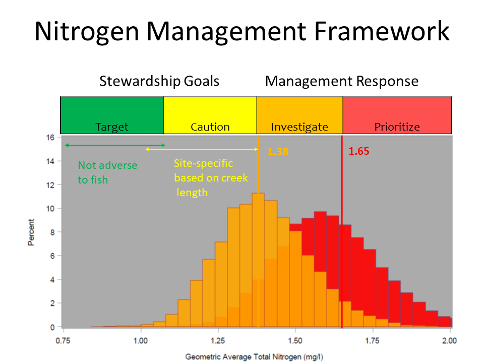
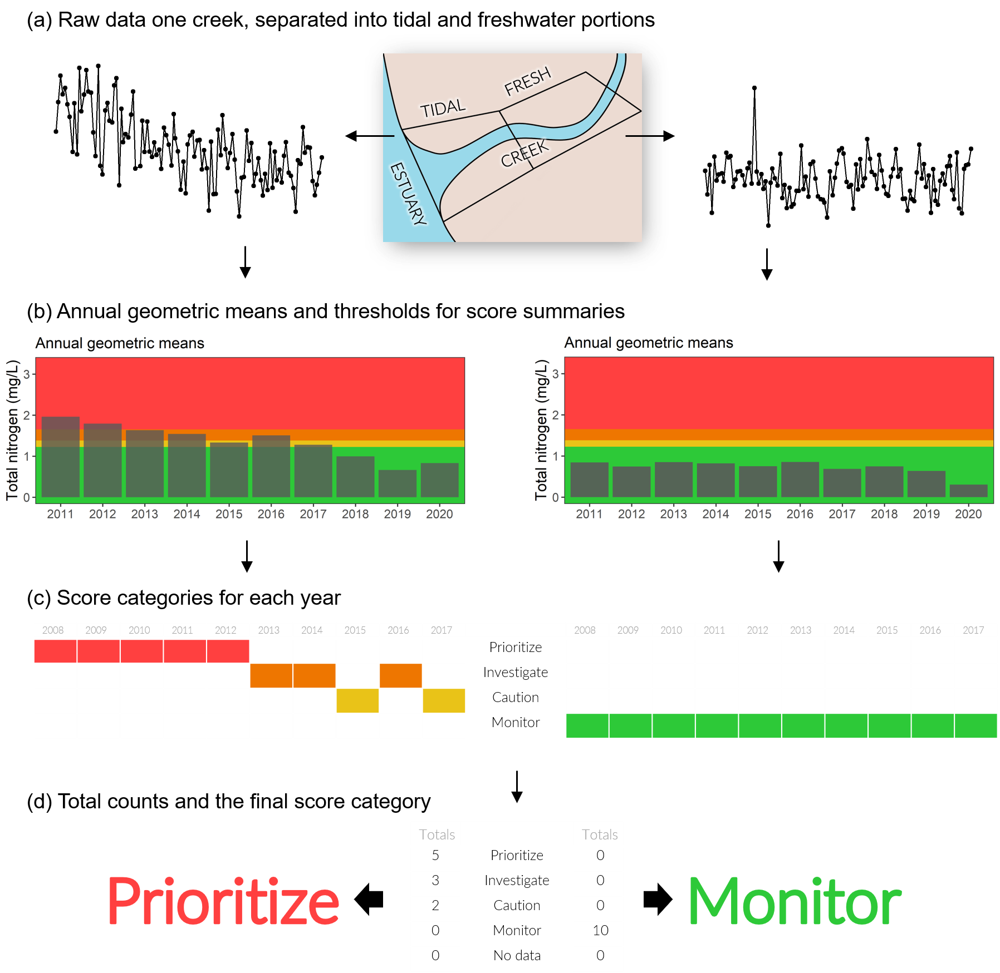
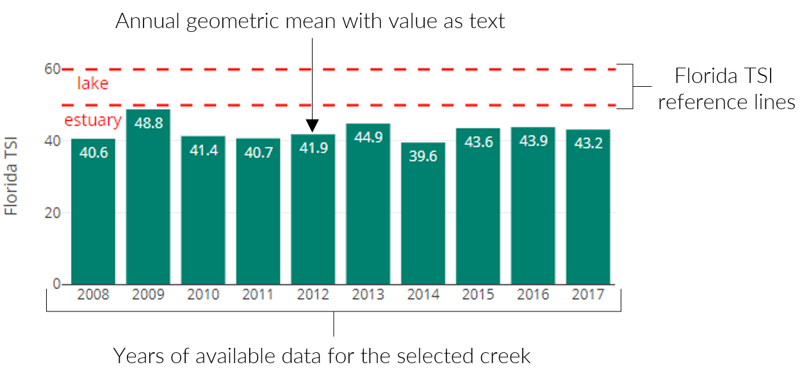
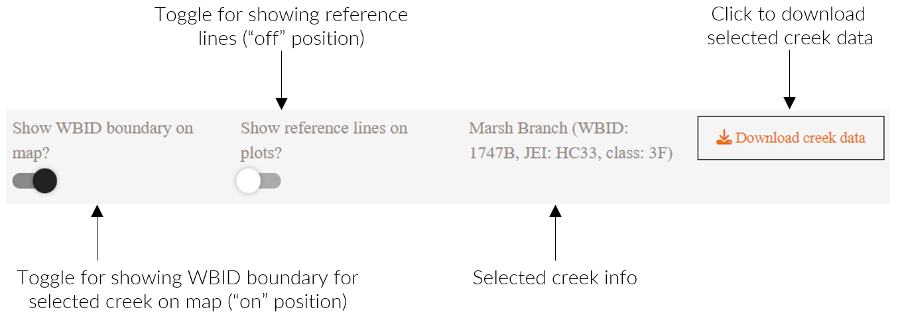

```{r setup, include=F}
knitr::opts_chunk$set(echo = F, message = F, warning = F)

library(flexdashboard)
library(tidyverse)
library(tbeptools)
# devtools::load_all('../tbeptools')
library(mapedit)
library(leaflet.extras)
library(sf)
library(reactable)
library(shinydashboard)
library(plotly)
library(shinyWidgets)

# # style file
# styles <- readLines('https://raw.githubusercontent.com/tbep-tech/css-styling/master/styles.css')
# writeLines(styles, 'styles.css')

data(tidres)
data(tidalcreeks)
data(cntdat)
data(cntdatrdr)

st_crs(tidalcreeks) <- 4326

# only show tb watershed
tidres <- tidres[tidres$id %in% tidalcreeks$id, ]

source('R/funcs.R')

# iwr ref year
yr <- 2021

# color ramp for indicator plots
pal <- RColorBrewer::brewer.pal(8,  'Blues')

downloadButtonRmd <- function (outputId, label = "Download", class = NULL, ...)  {
  tags$a(id = outputId, class = paste("btn btn-default shiny-download-link", 
                                      class), href = "", target = "_blank", download = NA, 
         icon("download"), label, ...)
}
```

```{r reactives}
# overview map
allmap <- reactive({
  
  # input
  clssel1 <- input$clssel1
  
  req(clssel1)
  
  out <- tidres %>% 
    filter(grepl(clssel1, class)) %>% 
    show_tdlcrk
  
  return(out)
  
})

# reactive edits module for map selection
edits <- reactive({
  
  # input
  allmap <- allmap()
  
  # this modifies available options in map selection toolber
  tomap <- allmap %>% 
    addDrawToolbar(
      polylineOptions = FALSE,
      circleOptions = FALSE,
      circleMarkerOptions = FALSE,
      markerOptions = FALSE,
      editOptions = editToolbarOptions()#,
      # singleFeature = TRUE
    )
  
  out <- callModule(editMod, 'editor', tomap)
  
  return(out)
  
})

# selection from map as sf object, same crs as biodat
mapsel <- reactive({

  # input
  edits <- edits()()
  clssel1 <- input$clssel1
  
  # requires edits to continue  
  req(!is.null(edits$finished))

  # get selection
  out <- edits$finished %>% 
    st_transform(crs = st_crs(tidalcreeks)) %>% 
    st_intersection(tidalcreeks, .) %>% 
    st_set_geometry(NULL) %>% 
    inner_join(tidres, by = c('id', 'wbid', 'JEI', 'class')) %>% 
    filter(grepl(clssel1, class)) %>% 
    mutate(`Length (km)` = round(Creek_Length_m / 1000, 2)) %>% 
    select(wbid, JEI, Class = class, `Length (km)`, monitor, caution, investigate, prioritize, score)
  
  req(nrow(out) > 0)
  
  return(out)

})

# reactable output from map selection
maptab <- reactive({
  
  # requires edits to continue  
  validate(
    need(!is.null(edits()()$finished), 'Make a selection from the map using the draw features')
  )
  
  # inputs
  mapsel <- mapsel()
  
  # format
  out <- reactable(mapsel, 
                   columns = list(
                         score = colDef(
                           style = function(value){
                             list(background = colfun(value))
                           }), 
                         `Length (km)` = colDef(
                            aggregate = 'sum', 
                            format = colFormat(digits = 2),
                            cell = function(value) {
             
                              width <- paste0(value / max(mapsel$`Length (km)`, na.rm = T) * 100, "%")
                              value <- format(value, width = 9, justify = "right")

                              bar <- div(
                                class = "bar-chart",
                                style = list(marginRight = "6px"),
                                div(class = "bar", style = list(width = width, backgroundColor = "#958984"))
                              )
                              div(class = "bar-cell", span(class = "number", value), bar)
                            }
                         ), 
                         # wbid = colDef(
                         #   aggregate = 'count'
                         # ), 
                         # JEI = colDef(
                         #   aggregate = 'count'
                         # ),
                         monitor = colDef(
                           aggregate = 'sum'
                         ), 
                         caution = colDef(
                           aggregate = 'sum'
                         ),  
                         investigate = colDef(
                           aggregate = 'sum'
                         ),  
                         prioritize = colDef(
                           aggregate = 'sum'
                         )
                         
                    ), 
                   groupBy = 'score',
                   filterable = T, pageSizeOptions = c(10, 20, nrow(mapsel)), defaultPageSize = 10,
                   showPageSizeOptions = T, compact = T
  )
  
  return(out)
  
})

# no data gauge
nodtscr <- reactive({
  
  # input
  mapsel <- mapsel()
  sumsel <- input$sumsel
  typsel <- input$typsel
  
  # get gauge
  out <- sumfun(mapsel, sumsel, typsel, 'No Data')
  
  return(out)
  
})

# green gauge
grenscr <- reactive({
  
  # input
  mapsel <- mapsel()
  sumsel <- input$sumsel
  typsel <- input$typsel
  
  # get gauge
  out <- sumfun(mapsel, sumsel, typsel, 'Monitor')
  
  return(out)

})

# yellow gauge
yellscr <- reactive({
    
  # input
  mapsel <- mapsel()
  sumsel <- input$sumsel
  typsel <- input$typsel
  
  # get gauge
  out <- sumfun(mapsel, sumsel, typsel, 'Caution')
  
  return(out)
  
})

# orange gauge
orngscr <- reactive({
    
  # input
  mapsel <- mapsel()
  sumsel <- input$sumsel
  typsel <- input$typsel
  
  # get gauge
  out <- sumfun(mapsel, sumsel, typsel, 'Investigate')
  
  return(out)
  
})

# reds gauge
redsscr <- reactive({
  
  # input
  mapsel <- mapsel()
  sumsel <- input$sumsel
  typsel <- input$typsel
  
  # get gauge
  out <- sumfun(mapsel, sumsel, typsel, 'Prioritize')
  
  return(out)
  
})

# summary text
sumtxt <- reactive({
  
  mapsel <- mapsel()
  sumsel <- input$sumsel
  typsel <- input$typsel
  
  req(typsel == 'sum')
  
  if(sumsel == 'by count')
    tot <- nrow(mapsel) %>% 
    paste('streams')
  
  if(sumsel == 'by creek length')
    tot <- sum(mapsel$`Length (km)`, na.rm = T) %>% 
      round(1) %>% 
      paste('km')
    
  out <- paste('Total in selection:', tot)
  
  return(out)
  
})

# table on download tab
dwntab <- reactive({
  
  # requires edits to continue  
  validate(
    need(!is.null(edits()()$finished), 'Make a selection from the map using the draw features')
  )
  
  # inputs
  mapsel <- mapsel()
  
  # format
  out <- reactable(mapsel, 
                   columns = list(
                         score = colDef(
                           style = function(value){
                             list(background = colfun(value))
                           })
                    ), 
                    filterable = T, pageSizeOptions = c(10, 20, nrow(mapsel)), defaultPageSize = 20,
                    showPageSizeOptions = T, compact = T
  )
  
  return(out)
  
})

# polyline selection base map
tomap <- reactive({
  
  # input
  clssel2 <- input$clssel2
  
  out <- tidalcreeks %>%
    dplyr::inner_join(tidres, by = c('id', 'wbid', 'JEI', 'class', 'name')) %>%
    filter(grepl(clssel2, class)) %>% 
    dplyr::mutate(
      score = factor(score, levels = c('No Data', 'Monitor', 'Caution', 'Investigate', 'Prioritize'))
    )
  
  return(out)

})

# creek info from selection
seltxt <- reactive({
  
  req(selcrk)

  # data to plot
  seldat <- tidres %>% 
    filter(id %in% selcrk) %>% 
    select(name, wbid, JEI, class) %>% 
    mutate(
      name = case_when(
        name == '' ~ 'No name', 
        T ~ name
      )
    )
  
  out <- paste0(seldat$name, ' (WBID: ', seldat$wbid, ', JEI: ', seldat$JEI, ', class: ', seldat$class, ')')
  
  return(out)
  
})

# radar plot of context indicators for selected creek
cntcrkrdr <- reactive({
  
  # inputs
  req(selcrk)
  
  out <- try({show_tdlcrkradar(selcrk, cntdatrdr, lbsz = 1.5, ptsz = 2.5)}, silent = T)

  return(out)
  
})

# plot of context indicators for selected creek
cntcrkplo <- reactive({
  
  # inputs
  thrsel <- input$thrsel
  
  req(selcrk)
  
  out <- show_tdlcrkindic(selcrk, cntdat, yr = yr, thrsel = thrsel, pal = '#00806E')

  return(out)
  
})

# plot of ecdf context indicators for selected creek
cntcrkcdf <- reactive({
  
  # inputs
  thrsel <- input$thrsel
  
  req(selcrk)

  out <- show_tdlcrkindiccdf(selcrk, cntdat, yr = yr, thrsel = thrsel, pal = c('#427355', 'lightgrey', '#004F7E'))

  return(out)
  
})
```

```{r map}
# polyline selection
output$map <- renderLeaflet({
  
  # input
  clssel2 <- input$clssel2
  tomap <- tomap()
  
  out <- tidres %>% 
    filter(grepl(clssel2, class)) %>% 
    show_tdlcrk %>% 
    leaflet::addPolylines(data = tomap, opacity = 0, weight = 12,
              layerId = ~id, label = ~paste0("WBID: ", wbid, ", JEI: ", JEI, ', Name: ', name, ', Creek score: ', score)
    )
  
  return(out)
  
})

# leaflet proxy for marker select
map <- leafletProxy('map')

# binding for marker select and year
makeReactiveBinding('selcrk')

# the selection
observeEvent(input$map_shape_click, {
  selcrk <<- input$map_shape_click$id
})

observeEvent(input$map_shape_click, {
  
  # input
  tomap <- tomap()
  
  # filter spatial data by selection
  selcrkln <- tidalcreeks %>% 
    filter(id %in% selcrk)
  
  # clear markers on input select, add all points and selected point
  map <- map %>% 
    leaflet::clearMarkers() %>%
    leaflet::clearShapes() %>%
    leaflet::clearControls() %>%
    leaflet::addPolylines(data = selcrkln, opacity = 1, weight = 8, color = 'black') %>% 
    leaflet::addLegend(data = tomap, "topright", pal = pal_exp, values = ~score,
              title = "Creek scores",
              opacity = 1
    ) %>%
    leaflet::addPolylines(data = tomap, opacity = 1, weight = 1.5, color = ~pal_exp(score)) %>% 
    leaflet::addPolylines(data = tomap, opacity = 0, weight = 12,
              layerId = ~id, label = ~paste0("WBID: ", wbid, ", JEI: ", JEI, ', Name: ', name, ', Creek score: ', score)
    )

})
```

```{r downloadhandlers}
# data for creek pop selection
output$cpdwntab <- downloadHandler(
  filename = function(){'tidalcreek_pop.csv'},
  content = function(file){
    todl <- mapsel() 
    write.csv(todl, file, quote = T, row.names = F)
  }
)

# data for individual creek selection
output$icdwntab <- downloadHandler(
  filename = function(){'tidalcreek_sel.csv'},
  content = function(file){
    todl <- cntdat %>% 
      filter(id %in% selcrk) %>% 
      select(-id)
    write.csv(todl, file, quote = T, row.names = F)
  }
)
```

OVERVIEW
===========================================================

Column {data-width=650}
-----------------------------------------------------------------------

### WELCOME TO THE TIDAL CREEK ASSESSMENT DASHBOARD [v1.0](https://github.com/tbep-tech/tidalcreek-dash/releases/tag/v1.0)!

<div class = "row">
<div class = "col-md-2"></div>
<div class = "col-md-8">

```{r, echo = F, out.width = '100%', fig.align = 'center'}

```

The objective of the tidal creek dashboard is to provide a screening level evaluation of tidal creek water quality across a large population of creeks using a "Report Card" type scoring system as well as a host of site-specific indicators of creek condition that resource managers can utilize to help prioritize management level investigations. The dashboard contents are not regulatory evaluations and do not carry any regulatory authority. Rather, the dashboard provides supplemental information that resource managers and researchers can use to evaluate additional information on creek condition for creeks with adverse regulatory outcomes and for all creeks outside of any regulatory framework. The following bullets describe the dashboard contents. The dashboard is currently using Florida DEP [Impaired Waters Rule](http://publicfiles.dep.state.fl.us/dear/IWR/){target="_blank"}, Run 61 (posted 5-27-2021). 

The [__DETAILS__](#details) page provides an explanation of the methodology for generating the Report Card outcomes.

The [__REPORT CARD__](#report-card) page provides a way to summarize report card outcomes (map selection tab) by drawing a polygon over any particular group of creeks and visualizing summary statistics of those report card outcomes. This page also includes tabs to download the report card outcomes (download) and a tab (use and interpretation) that explains the use and interpretation of the report card.  

The [__INDIVIDUAL CREEK INDICATORS__](#individual-creek-indicators) page provides in depth examination of the data for an individual creek by clicking on any creek with data in the population. This page includes tabs containing the "Radar Charts" described in Wessel et al. 2021, "Bar Plots" of annual water quality statistics, the distribution of those statistics relative to the population of creeks with data (Relative Values tab), and a tab containing use and interpretation of the individual creek metrics.

Updates to the dashboard are continuous. Please check [#HERE](https://tbep-tech.github.io/tidalcreek-stats/){target="_blank"} for the latest updates as well as additional resources relevant to the dashboard development and current areas of research.

All site content created by [Marcus Beck](mbeck@tbep.org).  Original tidal creek scoring method adapted from code created by [Mike Wessel](mwessel@janickienvironmental.com). Full methods are described in TBEP technical reports [#02-16](https://drive.google.com/file/d/1YeaZUqIFiak8KdJLSqNrCsQETf8_XTzZ/view){target="_blank"}, [#02-20](https://drive.google.com/file/d/1n4okSVtNSswVXv1Lje-qMopNZdvUrQnt/view){target="_blank"} and [Wessel et al. 2021](https://doi.org/10.1007/s12237-021-00974-7){target="_blank"}. The page source content can be viewed on [Github](https://github.com/tbep-tech/tidalcreek-dash){target="_blank"}.

<a rel='license' href='http://creativecommons.org/licenses/by/4.0/'></a>&nbsp;&nbsp;This dashboard is licensed under a <a rel='license' href='http://creativecommons.org/licenses/by/4.0/'>Creative Commons Attribution 4.0 International License</a>.

[](https://zenodo.org/badge/latestdoi/231956629){target="_blank"}

</div>
<div class = "col-md-2"></div>
</div>

DETAILS
===========================================================

Column {data-width=650}
-----------------------------------------------------------------------

### WELCOME TO THE TIDAL CREEK ASSESSMENT DASHBOARD [v1.0](https://github.com/tbep-tech/tidalcreek-dash/releases/tag/v1.0)!

<div class = "row">
<div class = "col-md-2"></div>
<div class = "col-md-8">

#### Background

Tidal creeks or tributaries are essential habitats in the Tampa Bay estuary and serve as important focal points for understanding watershed inputs that affect water quality. A fundamental goal of the Tampa Bay Estuary Program is to develop effective nutrient management strategies to support the ecological function of tidal tributaries. In partnership with Sarasota Bay NEP, Coastal & Heartland NEP, Mote Marine Laboratory, and local government and agency stakeholders, preliminary methods have been developed for assessing the health of tidal tributaries for fisheries based on exceedances of nitrogen concentrations (TBEP technical reports [#02-16](https://drive.google.com/file/d/1YeaZUqIFiak8KdJLSqNrCsQETf8_XTzZ/view){target="_blank"}, [#02-20](https://drive.google.com/file/d/1n4okSVtNSswVXv1Lje-qMopNZdvUrQnt/view){target="_blank"} and [Wessel et al. 2021](https://doi.org/10.1007/s12237-021-00974-7){target="_blank"}). These assessments can support tracking of water quality management goals and can help refine restoration and management plans in priority tributaries, including those in need of hydrologic restoration that can support critical nursery habitats for sportfishes.

This dashboard provides an interface to view and download results for all tidal creeks in the identified population of over 300 creeks in southwest Florida. The [__REPORT CARD__](#report-card) tab provides an overview of creek scores across the region and the [__INDIVIDUAL CREEK INDICATORS__](#individual-creek-indicators) tab provides detailed information for selected creeks.  Click on each tab to view the results, download data, and read more about the information presented.

#### Methods

The tidal creek dashboard uses data included in the [tbeptools](https://tbep-tech.github.io/tbeptools/) package for the population of tidal creeks in southwest Florida, including those creeks designated as tidal ([FDEP classes](https://floridadep.gov/dear/water-quality-standards/content/surface-water-quality-standards-classes-uses-criteria) 2 and 3M) as well as stations lcoated in hte contributing freshwater portion of the stream within 1.6 kilometers of the estimated saltwater interface. The assessments use data from the FDEP [Impaired Waters Rule](https://www.flrules.org/gateway/ChapterHome.asp?Chapter=62-303) database, currently updated to Run 61 available [here](http://publicfiles.dep.state.fl.us/DEAR/IWR/). This run includes data through May 27th, 2021 though 2021 data are removed from the evaluations. Raw data for both the IWR database and the tidal creek spatial date are available from the tbeptools package (see the [vignette](https://tbep-tech.github.io/tbeptools/articles/tidalcreeks.html)).  

Similar to the [water quality report card](https://shiny.tbep.org/wq-dash/), tidal creeks are assigned to categories within a management framework intended to serve as both a mechanism for evaluating data relative to the need for management actions, and to identify stewardship goals that, if properly pursued, preclude the need for any regulatory actions.  These categories were based on fish as a biological response indicator.  Additional indicators that may be more sensitive to elevated nutrient concentrations have not yet been identified and are an area of current research.  Tidal creeks are assigned to one of four categories: 

<span style="color:#33FF3B; text-shadow: 0 0 3px #333;">__Monitor__</span>: Creek is at or below nitrogen concentrations that protect individual creek types within the larger population of creeks.

<span style="color:#F9FF33; text-shadow: 0 0 3px #333;">__Caution__</span>: Creek nutrients showing signs of elevated nutrient concentrations that may increase risk of eutrophic condition.

<span style="color:#FFA500; text-shadow: 0 0 3px #333;">__Investigate__</span>: Creek nutrient concentrations above margin of safety to protect creek from potential impairment.  

<span style="color:#FF7F50; text-shadow: 0 0 3px #333;">__Prioritize__</span>: Creek nutrient concentrations have exceeded regulatory standard for associated freshwater portion of the tributary in at least one year indicating that actions may be needed to identify remediative measures to reduce nutrients in the creek.

Conceptually, these thresholds appear in the figure below.

```{r, echo = F, out.width = '65%', fig.align = 'center'}

```

The Prioritize category was defined based on Florida's freshwater stream numeric nutrient criteria (NNC).Two different freshwater stream NNC are applicable to our region; the West Central NNC of 1.65 mg/l and  Peninsular region NNC of 1.54 mg/l. The histograms in the above figure represents a range of annual geometric mean (AGM) nitrogen concentrations associated with the Prioritize and Investigate categories which are based on the NNC. In the example above, the maximum expected distribution of AGMs not to exceed of 1.65 mg/l with a 1:3 exceedance probability as defined in F.A.C. 62-303 was generated using monte carlo simulation and the pooled standard deviation from data collected during the first creeks study. The Investigate category was then defined as an explicit margin of safety by adjusting the distribution to find the grand geometric average that would result in a 1:20 chance of exceeding 1.65 mg/l. Assignment of a creek into the Caution category depended on a creek length adjustment as described below to protect smaller creeks from elevated nutrient concentrations.  

Note that the "Caution" category is a function of creek length which is an area of current research. Check the updates page for additional details. 

```{r}
totab <- tidaltargets %>% 
  rename(
    Region = region,
    Prioritize = prioritize,
    Investigate = investigate, 
    Caution = caution
  )
knitr::kable(totab)
```

A temporal component is also included in the assessment, whereby the overall score considers the individual categories that were observed in the previous ten years for the period of record.  For this analysis, the tidal creek assessments include data from 2011 to 2020 coinciding with the ten years prior from the most current year in the IWR period of record.  Each year of data in which nitrogen was measured at a site is given a score based on the categories defined above and an overall score is based on a frequency count for each category over the 10 year period.  The overall scores are typically assigned conservatively, such that the overall score is based on the highest category that is exceeded.  For example, a creek is assigned to the "Prioritize" (red) category if only two of ten years exceeds the Prioritize threshold, even if the remaining years are at monitor concentrations. Therefore, the framework can be considered a risk characterization representing the risk of the creek exceeding a particular threshold level.  

A workflow showing how the scores are calculated on two hypothetical water body id (WBID) locations for the same creek (JEI) is shown below:

```{r, echo = F, out.width = '70%', fig.align = 'center'}

```

Finally, it is important to again note that the framework outcomes do not carry any regulatory authority and are not intended to supersede any State or Federal regulatory standards currently in place, including aquatic life criteria used to evaluate waterbody impairments or pollutant load reduction goals associated with existing or forthcoming total maximum daily loads (TMDLs). The nutrient management framework was developed to serve as a screening tool to identify creeks with elevated nutrient concentrations for further evaluation to protect their in stream ecology but is not designed to explicitly identify regulatory impairments (or lack thereof) or the needs of downstream waterbodies such as larger estuarine waters that may be in need of nutrient load reductions.

All site content created by [Marcus Beck](mbeck@tbep.org).  Original tidal creek scoring method adapted from code created by [Mike Wessel](mwessel@janickienvironmental.com).  Full methods are described in TBEP technical reports [#02-16](https://drive.google.com/file/d/1YeaZUqIFiak8KdJLSqNrCsQETf8_XTzZ/view){target="_blank"}, [#02-20](https://drive.google.com/file/d/1n4okSVtNSswVXv1Lje-qMopNZdvUrQnt/view){target="_blank"} and [Wessel et al. 2021](https://doi.org/10.1007/s12237-021-00974-7){target="_blank"}. Original data from Florida DEP [Impaired Waters Rule](http://publicfiles.dep.state.fl.us/dear/IWR/){target="_blank"}, Run 56. The page source content can be viewed on [Github](https://github.com/tbep-tech/tidalcreek-dash){target="_blank"}.

[](https://zenodo.org/badge/latestdoi/231956629){target="_blank"}

</div>
<div class = "col-md-2"></div>
</div>

REPORT CARD
===========================================================

Column {data-width=250}
-----------------------------------------------------------------------

```{r}
# map won't render on startup unless assessment tab selected to trigger maptab
output$maptab <- renderReactable(maptab())

# this renders the map by initializing maptab on startup
outputOptions(output, "maptab", suspendWhenHidden = FALSE)

# selection editor
editModUI('editor')
```


Column {.tabset .tabset-fade data-width=650}
-----------------------------------------------------------------------

```{r}
column(12, 
  inputPanel(
    selectInput(inputId = 'clssel1', label = 'Toggle creek type?', choices = list('All' = '^3M$|^3F$|^2$|^1$', `Tidal (class 3M, 2)` = '^3M$|^2$', `Fresh (class 3F, 1)` = '^3F$|^1$'), selected = 'All')
  )
)
```

### MAP SELECTION

```{r allmap}
output$nodtscr <- renderGauge(nodtscr())
output$grenscr <- renderGauge(grenscr())
output$yellscr <- renderGauge(yellscr())
output$orngscr <- renderGauge(orngscr())
output$redsscr <- renderGauge(redsscr())

fillCol(
  flex = c(1, NA, 0.25),
  reactableOutput('maptab'),
  inputPanel(
        selectInput('sumsel', 'Select summary category:', choices = c('by count', 'by creek length')), 
        selectInput('typsel', 'Select summary type:', choices = c('%', 'sum')), 
        renderText(sumtxt())
      ),
  fillRow(
    gaugeOutput('nodtscr'),
    gaugeOutput('grenscr'),
    gaugeOutput('yellscr'),
    gaugeOutput('orngscr'),
    gaugeOutput('redsscr')
  )
)
```

### DOWNLOAD

```{r}
fillCol(
  flex = c(NA, 1),
  inputPanel(
    downloadButtonRmd('cpdwntab', 'Download table')
  ),
  renderReactable(dwntab())
)
```

### USE AND INTERPRETATION

The REPORT CARD tab provides an overview of the distribution of creeks that are assigned to each score category.  Begin by using the draw features on the map to select an area of interest. The tables and gauges under the MAP SELECTION and DOWNLOAD tabs will populate only after a selection is made. If only tidal creeks are desired, toggle the creek type switch to "tidal". 

The draw area can be a custom polygon or a rectangle.  Begin by clicking on one of the icons on the map (example shown below) and clicking locations on the map to create the boundaries. Click the "Finish" button when the selection is done, modify points with "Delete last point", and "Cancel" to start over: 

<br>

<br>

In the below example, a custom polygon was drawn over creeks that drain into Tampa Bay. 

<br>

<br>

The MAP SELECTION tab shows a table that summarizes the number of creeks in each score category for the selection from the map.  The table is grouped by each category with the total number of creeks shows in parentheses.  In the current selection, there are 49 creeks in the "Monitor" category, 113 with "No Data", 11 in "Investigate", 12 in "Prioritize", and one creek in the "Caution" category.  The total creek length in each category is shown in the "Length (km)" column (e.g., there are 368 km of creeks in the "Monitor" category).  The remaining columns ("monitor", "caution", "investigate", "prioritize") are counts of the number of years in the previous ten years that creeks were categorized accordingly.  The distribution of the counts in these categories define the overall creek score (e.g., if a creek has more years in the prioritize category, it will likely be assigned an overall score of "Prioritize"). The unexpanded table should look like this: 

<br>

<br>

The categories in the table can be expanded by clicking on a row.  The expanded rows show data for the individual creeks that are assigned to each category.  The bar plots for the length column indicate relative lengths of each creek.  The expanded table should look like this (only the "Investigate" and "Prioritize" categories are shown below):  

<br>

<br>

The gauges on the bottom of the MAP SELECTION tab provide additional summaries of the distribution of creeks by category for the selection.  Summaries can show a percentage of creeks in each category, the  number of creeks in each category, percentages of the total creek length in each category, and the total creek length as a sum in each category.  In the example selection, there are 734 km of creeks with "No Data", 368 km in the "Monitor" category, 3 km in the "Caution" category, 78 km in the "Investigate" category, and 78 km in the "Prioritize" category. 

<br>

<br>

The DOWNLOAD tab provides the same information as the previous tab, except that the creeks are not grouped by score category.  The "Download table" button can be clicked to download the summary data for the current map selection. 

INDIVIDUAL CREEK INDICATORS
===========================================================

Column {data-width=250}
-----------------------------------------------------------------------

```{r mapout}
leafletOutput('map')
```

Column {.tabset .tabset-fade data-width=650}
-----------------------------------------------------------------------

```{r}
column(12, 
  inputPanel(
    selectInput(inputId = 'clssel2', label = 'Toggle creek type?', choices = list('All' = '^3M$|^3F$|^2$|^1$', `Tidal (class 3M, 2)` = '^3M$|^2$', `Fresh (class 3F, 1)` = '^3F$|^1$'), selected = 'All'),
    materialSwitch(inputId = 'thrsel', label = 'Show reference lines on plots?'),
    renderText(seltxt()),
    renderUI({
      req(selcrk)
      downloadButtonRmd('icdwntab', 'Download creek data')
    })
  )
)
```

### RADAR PLOTS

```{r}
renderPlot({
  
  validate(
    need(!is.null(selcrk), 'Make a selection from the map by clicking on a creek')
  )
  
  validate(
    need(!is.null(cntcrkplo()), 'No data...')
  )
  
  # input
  cntcrkrdr <- cntcrkrdr()

  validate(
    need(!inherits(cntcrkrdr, 'try-error'), 'Not a marine tidal creek (select 3M, 2 above)')
  )
  
  cntcrkrdr

})
```

### BAR PLOTS

```{r}
renderPlotly({
  
  validate(
    need(!is.null(selcrk), 'Make a selection from the map by clicking on a creek')
  )
  
  validate(
    need(!is.null(cntcrkplo()), 'No data...')
  )
  
  cntcrkplo()

})
```

### RELATIVE VALUES

```{r}
renderPlotly({
  
  validate(
    need(!is.null(selcrk), 'Make a selection from the map by clicking on a creek')
  )
  
  validate(
    need(!is.null(cntcrkplo()), 'No data...')
  )
  
  cntcrkcdf()

})
```

### USE AND INTERPRETATION

Ten years of data included in the IWR database are used (if available) to estimate the summary assessment categories. Additional water quality parameters in this database can provide context for interpreting the outcomes.  For the dashboard, these variables include:

1. __Chlorophyll-a (ug/L)__: A measure of chlorophyll concentration in the water column, often indicative of system productivity
1. __Total Nitrogen (mg/L)__: The total concentration of nitrogen in the water column, indicates the amount of inorganic nutrients available for primary producers
1. __Chlorophyll-a to Total Nitrogen ratio__: A ratio between the two that can indicate how much nutrients are available or have already been used by primary producers
1. __Dissolved Oxygen (mg/L)__: The concentration of dissolved oxygen in the water column, low values indicate metabolic or microbial processes that consume oxygen are degrading aquatic habitat
1. __Florida Trophic State Index (TSI)__: A composite index ranging from 0 - 100 that jointly considers chlorophyll and nutrients with higher values indicating more eutrophic conditions, described in [Paulic et al. 1996](http://www.hillsborough.wateratlas.usf.edu/upload/documents/1996%20Water-Quality%20Assessment%20for%20the%20State%20of%20Florida%20Section%20305(b)%20Main%20Report.pdf)
1. __Nitrate ratio__: Ratio of inorganic nitrate concentrations between source (upstream/freshwater) and tidal portions of a creek.  Values greater than one indicate the upstream portion is a source of nitrate.

Indicator data are summarized for individual creeks using the RADAR PLOTS, BAR PLOTS and RELATIVE VALUES tabs. 

The RADAR PLOTS show the percentage of years where an indicator exceeds a relevant threshold. This only applies to the marine WBIDs of the tidal creeks (Florida DEP class 2, 3M). Six indicators are returned with percentage exceedances based on total nitrogen greater than 1.1 mg/L, chlorophyll greater than 11 ug/L, trophic state index greater than 55 (out of 100), nitrate/nitrite ratio between marine and upstream segments greater than one, chlorophyll and total nitrogen ratios > 15, and percentage of years more where than ten percent of observations were below DO percent saturation of 42.  The plot can provide a quick visual assessment of water quality characteristics to prioritize for management actions to improve creek condition.  In the example below, the nitrate ratio and DO saturation values exceed relevant thresholds for all (100%) of the years of data for the creek, suggesting these may be particular issues to address for managing the location.

<br>

<br>

The BAR PLOTS are annual averages for the six context indicators at the selected creek.  These plots can be used to assess:

1. Data availability- many creeks have no data or only a few years within the preceding ten years.
1. Trends over time.
1. Magnitude of the annual means relative to references for "healthy" systems.

<br>

<br>

In the above figure, an example bar plot is shown with relevant parts highlighted. There are two references lines for the Florida TSI that show values for estuary (top) and lake (bottom) conditions for "healthy" environments.  The annual values (bars) for each year of data are well below these values, indicating relatively low primary productivity. 

The RELATIVE VALUES tab shows similar information except that empirical cumulative distribution functions (CDF) are plotted as guides relative to the selected creek. This information can be used to compare the water quality conditions at the selected creek to the "population" in southwest Florida. Annual averages for each indicator and each year for the selected creek are plotted on the CDF curves. Location of the points indicates both a comparison to the population and the trajectory of indicators over time (i.e., green are older observations and blue are more recent). Holding the mouse cursor over a point shows the year and holding the cursor over the line shows the percentile value from the CDF.

<br>

<br>

In the above figure, the values for the selected creek are overlaid on the CDF curve. Compared to the rest of the creeks in the dataset, the TSI values for the selected creek are relatively lower (less than the 25th percentile).  

Finally, the controls at the top can be used to toggle the threshold lines, view information about the selected creek, and download the data for the context indicators for the selected creek. 

<br>

<br>